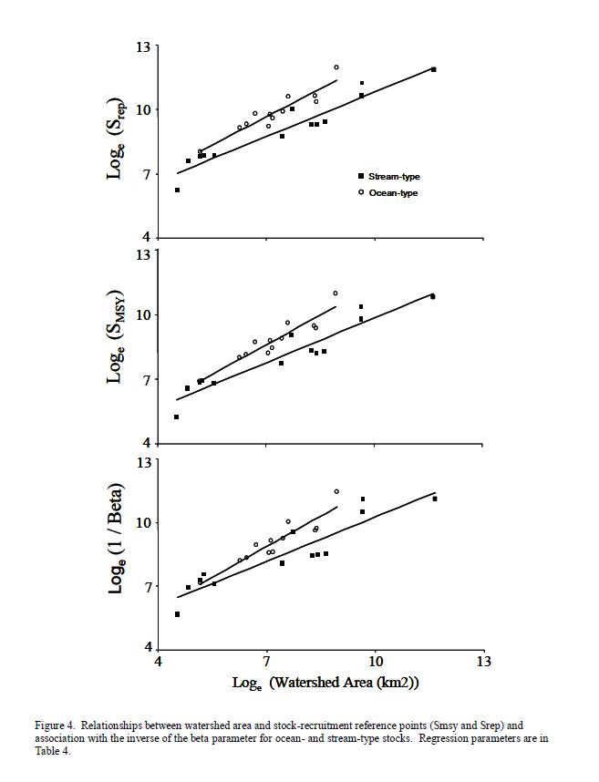
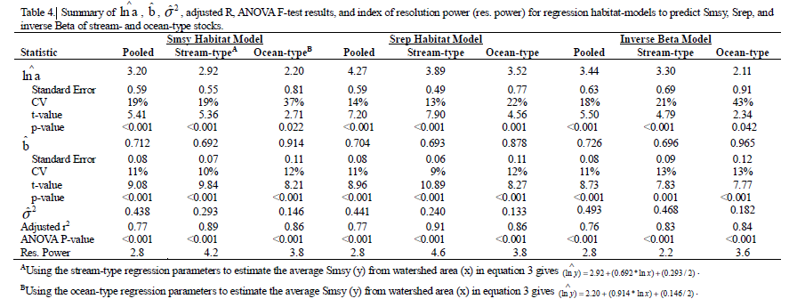

<!-- Note/comment syntax for html -->

```{r setup, include=FALSE}
# knitr::opts_chunk$set(echo = TRUE)
```

```{r libraries, echo=FALSE, message=FALSE, warning=FALSE}
library(tidyverse)
library(nimble)
library(coda)
library(dplyr)
library(MCMCvis)
library(DHARMa)
library(ggplot2)
library(TMB)

library(rsample)
library(cowplot)
library(gridExtra)
library(reshape2)
library(zoo)
library(viridis)
library(hrbrthemes)
library(gsl)

library(knitr) # Tables
library(latex2exp) # For adding latex into plot labels

# library(geomtextpath)
```

```{r custom library, echo=FALSE, warning=FALSE, message=FALSE}
source(here::here("R/helperFunctions.R"))
source(here::here("R/PlotFunctions.R"))
source(here::here("R/IWAM_model.R"))
```

```{r custom Lambertw, echo=FALSE, warning=FALSE, message=FALSE}
## This seems like the best LambertsW function so far:
## https://github.com/cran/lamW/blob/master/R/lamW.R
nimLambertsW <- nimbleFunction(
  run = function(x = double()) {
    REXP <- 2.718281828459045090795598298427648842334747314453125 ## exp(1)
    REXPI <- 0.367879441171442334024277442949824035167694091796875 # exp(-1)
    EPS <- 2.2204460492503131e-16
      
    if (x == Inf) {
      return(Inf)
    } else if (x < -REXPI) {
      return(NaN)
    } else if (abs(x + REXPI) <= EPS) {
      return(-1.0)
    } else if (abs(x) <= 1e-16) {
      return(x)
    } else {
      if (abs(x) <= 6.4e-3) {
        ## When this close to 0 the Fritsch iteration may underflow. Instead,
        ## function will use degree-6 minimax polynomial approximation of Halley
        ## iteration-based values. Should be more accurate by three orders of
        ## magnitude than Fritsch's equation (5) in this range.
        ans <- (((((-1.0805085529250425e1 * x + 5.2100070265741278) * x -
               2.6666665063383532) * x + 1.4999999657268301) * x -
               1.0000000000016802) * x + 1.0000000000001752) * x +
               2.6020852139652106e-18       
        ## Minimax Approximation calculated using R package minimaxApprox 0.1.0
        return(ans);

      } else if (x <= REXP) {
        p = sqrt(2.0 * (REXP * x + 1.0));
        Numer = (0.2787037037037037 * p + 0.311111111111111) * p - 1.0;
        Denom = (0.0768518518518518 * p + 0.688888888888889) * p + 1.0;
        w = Numer / Denom;
      } else {
        w = log(x)
        L_2 = log(w);
        L_3 = L_2 / w;
        L_3_sq = L_3 * L_3;
        w <- w + -L_2 + L_3 + 0.5 * L_3_sq - L_3 / w + L_3 / (w * w) - 
             1.5 * L_3_sq / w + L_3_sq * L_3 / 3.0;
      }
      ## Fritsch Iteration for up to 5 iterations.
      MaxEval <- 5
      CONVERGED <- FALSE
      k <- 2.0 / 3.0;
      i <- 0;
      while (!CONVERGED & i < MaxEval){
        z <- log(x / w) - w
        w1 <- w + 1.0
        q <- 2.0 * w1 * (w1 + k * z)
        qmz <- q - z
        e <- z / w1 * qmz / (qmz - z)
        CONVERGED <- abs(e) <= EPS
        w <- w*(1.0 + e)
        i <- i + 1
      }
      return(w)
    }
    returnType(double())
  }
)
```

# IWAM Model Description and Comparison

## Introduction

The purpose of this report is to:

-   Clearly and simply explain the background, usage, and differences of the TMB and NIMBLE IWAM models
-   Justify the usage of the new Nimble model
-   Introduce next steps in model development
-   Walk through the outputs of both models


## Datamap

The following function vignette/example is from the IWAM Package Repo hosted publicly through the Pacific Salmon Assess organization available at [this link.](https://github.com/Pacific-salmon-assess/iwam-package)

The package currently utilizes the following data sets:

-   *SRinputfile (Private)*: Private data-sets developed by Parken et al. (2006). Required to run the complete function and is available upon request. To be updated with publicly available data. Life histories are included: 1 = ocean type, 0 = stream type. Contains stock names, year, spawners, recruits, and life history identification.
-   *WatershedArea (Public)*: Internal input containing watershed areas per stock.
-   *CUPars_nBC (Public)*: Input file with Ricker $\alpha$'s without bias correction (CITATION) from Diana Dobson's Run Reconstruction coded in TMB. Has a higher estimate of Ricker $\alpha$ (lower Sgen).
-   *CUPars_wBC (Public)*: Input file with Ricker $\alpha$'s with bias correction (CITATION) from Diana Dobson's Run Reconstruction coded in TMB. Has a higher estimate of Ricker $\alpha$ (lower Sgen).
-   *WCVIStocks (Public)*: User watershed area input file. Must contain watershed areas, life history identification, enhancement identification, and stock name. Aggregation within the IWAM function can be done with both CU and Inlet scales.


## Over-arching Model Flow

The model, regardless of its form between Parken et al., Leirmann et al., and Holt et al., follow the following three model stages:

1.  Evaluation of the Ricker model using a spawner and recruit timeseries dataset

2.  Regression of Ricker model parameters against the watershed areas of the stocks included in the SR timeseries set

3.  Using the regression model estimate *new* Ricker model parameters and benchmarks for stocks where only watershed area is known

The main differences between the models occur in how each of the stages are handled internally, and how error is propagated between them. These differences will be explored in the following document.


## Model Variants

To describe the two main forms of the IWAM model, we will go step by step through the previously described steps, beginning with the core stock-recruitment model, the Ricker model.

-   Clearly and simply explain the background and usage of
    -   the IWAM TMB model
        -   The derivations from the Parken model and its current implementation within the Holt et al. 2023 model.
    -   the IWAM Nimble model
        -   The derivations from the Liermann model and its current implementation within the NIMBLE model by Paul and myself.
    -   Identify the core differences between the two model variants
        -   The parameterization of $S_{REP}$, and by that measure the exclusion of $\beta$
        -   2 vs. 4 regression models
        -   Methods of estimation (?)
        -   Propogation of error


### The Parken et al. 2006 and Holt et al. 2023 Model Type

The Ricker model is predominantly expressed in the following form:

$$
R = \alpha S e^{- \beta S}e^\tau
$$

Where $R$ is the recruitment per stock expressed as a $numeric$,

$S$ is the spawners or spawner abundance expressed as a $numeric$. Is it standard that both recruits and spawners be scaled values for modelling. 

$\alpha$ is the dimensionless number of recruits per spawner produced at very low spawner density (productivity), this may also be thought of as the intercept of the relationship between $\frac{R}{S}$ and $S$,

$\beta$ is the strength of the density dependence expressed as $1/S_{MAX}$ $spawners^{-1}$, similarly this can be described as the slope of the previously described relationship,

and $\tau$ is a normally distributed error term.

The Ricker model is written in this form to reflect a stochastic process (time ordered and random) by adding the log-normal error term $\tau$, a normal distributed term often used to account for environmental variability. This is the form used in both the Parken et al. (2006) and the Holt et al. (2023) models.

The baseline form is then made hierarchical and linearized by log transformation. The example shown below is the Parken and Holt Ricker linearized equation:

$$
log(\frac{R_i}{S_i}) = log(\alpha_i)-\beta_i \cdot S_i + \tau_i
$$

Where $\tau \sim Normal(0, \sigma_\tau)$,

In this regard, $\alpha$ is the intercept and $\beta$ is the slope of the spawner-recruit relationship, where $log(\alpha)$ has a hierarchical prior:

$log(\alpha_i) \sim Normal(\mu Log(\alpha), SigmaLog(\alpha))$,

$\mu log(\alpha_i) \sim Normal(1.5,5)$,

and $\sigma log(\alpha_i) \sim InvGamma(0.01,0.01)$.

Once the Ricker model parameters have been estimated and used to calculate $S_{MSY}$ and $S_{REP}$, the following regression model is made: 
<!-- To move elsewhere below: Both Parken and Holt form a total of 4 regression models, while Liermann forms two. Between both methods, there are two models - one for stream and one for ocean life histories. The difference is that Liermann only regresses $S_{REP}$ against watershed area, instead of also using $S_{MSY}$ as per Parken. The below equations show the Parken forms: -->

$$
ln(S_{MSY}) = ln(\delta_0) + \delta_1 \cdot ln(WA) + \delta_\epsilon
$$

$$
ln(S_{REP}) = ln(\gamma_o) + \gamma_1 \cdot ln(WA) + \gamma_\epsilon
$$

$$
\delta_\epsilon \sim N(0,\sigma_\delta^2)
$$

$$
\delta_\gamma \sim N(0,\sigma^2_\gamma)
$$

Where $\delta_0$ is the intercept and $\delta_1$ is the slope for the relationship between watershed area and either $S_{MSY}$ and $S_{REP}$. These are then adapted further to separate stream-type and ocean-type fish in the watershed area model. This is done by creating an offset with the baseline as the stream type population. This creates a total of 4 models.

$$
ln(S_{MSY}) = ln(\delta_{0,stream}) + ln(\delta_{0,ocean}) \cdot X + (\delta_{1,stream} + \delta_{1,ocean} \cdot X) \cdot ln(WA) + \delta_\epsilon
$$

where, $\delta_\epsilon \sim Normal(0,\sigma_\epsilon)$,

and $X = 0$ for stream type and $X = 1$ is for ocean type populations.

This equation is then duplicated for $S_{REP}$.

It is within the WA regression that Parken introduces a transform scalar in the form of $+\frac{\sigma^2}{2}$, which is added to the intercept. This accounts for skew of the mean when transforming out the log-space.

Once these regressions models are evaluated, the $\delta$ parameters are used to predict $S_{REP}$ or $S_{MSY}$ directly. These new predictions, are then fed into the bootstrapping process, which predicts the final estimates.

<!-- So the SMSY regression model is not even used in the calculation of S_GEN? How much different would estimates of S_MSY be, if only \alpha and S_REP were used like in the Sgen optimization? -->

It is within the bootstrapping, that the IWAM model differs from the Parken assumption of a global $\alpha$ given that the Parken estimates of $\alpha$ were too high for natural ecosystems. Within the IWAM bootstrapping model stage, a new a life-history model produced estimate of $\alpha$ is used. Ideally, $\alpha$ would be instead a regionally hierarchical parameter, and would not be altered at different stages.

With a new prior for $\alpha$ and the regression model estimated $S_{REP}$, the bootstrapping step does the following:

-   Re-estimate $\beta$ as $\beta = log(\alpha)/S_{REP}$
-   Re-estimate $S_{MSY}$ with the above $\beta$
-   Optimize for an estimate of $S_{GEN}$ using the supplied $\alpha$ and new $\beta$ (See Benchmark estimation for complete equation)

With the optimization complete, we are now supplied with our final estimates of $S_{GEN}$, $S_{MSY}$, and $S_{REP}$.

<!-- Tor: Question: Why is SMSY re-estimated a total of three times? Would the value change a little each time? Does it matter?-->


### The Liermann et al. 2011 Model Type

The following model is based off of Liermann et al. 2011. The main difference between this formulation of the Ricker model and the one used by Parken and Holt, is the scale of $\alpha$. Being either on the real or log-scale, and the parameterization of the watershed area regression to $S_{rep}$. The implication of these differences will be discussed further in the model differences section.

$$
R=Se^{\alpha(1-\frac{S}{S_{REP}})}
$$

where $R$ is the number of recruits,

$S$ is the number of spawners,

and, $S_{REP}$ is the point on the curve where $R = S$, also defined as the unfished equilibirum point.

$$
R_{ij}=S_{ij}exp[r_j(1-\frac{S_{ij}}{E_j})+w_{ij}]
$$

where $i$ is year class,

$j$ is population,

$r_j$ is the $log(slope)$ where $S_{ij} = 0$, with the following prior of:

$$
r_j \sim N(r_m, h_j)
$$

$$
r_m \sim N(0.6, 0.45)
$$

$$
h_j \sim N(0, E_{SD})
$$

$$
E_{SD} \sim Uniform(0,100)
$$

$E_{ij}$ is equivalent to $S_{REP}$, when $S_{REP} = R_{ij} = S_{ij}$,

and, $w_{ij}$ is the normally distributed independent random variable with mean 0 and population specific standard deviation.

This parameterization of the Ricker's model can be simplified into the following expression. It is important to note that this version excludes the previously defined $w_{ij}$:

$$
log(\frac{R}{S}_{pred}) = log\alpha_i(1 - \frac{S_i}{E_i})
$$

where $\alpha$ has a hierarchical prior of:

$$
log\alpha \sim N(log\alpha_0, log\alpha_{SD})
$$

$$
log\alpha_0 \sim N(1.5, 2.5)
$$

$$
log\alpha_{SD} \sim Uniform(0, 100)
$$

To avoid confusion, please keep in mind that Liermann substitutes $\alpha$ for $r_j$ as a the productivity parameter. We have opted to maintain the nomenclature of $\alpha$ as per the original Ricker equation.

This is finally evaluated as:

$$
log(\frac{R}{S}) \sim N(log(\frac{R}{S}_{pred}), \tau_{obs})
$$

where $\tau$ is the stock-specific precision defined as,

$$
\tau_{obs} \sim Gamma(0.001, 0.001)
$$
With the Ricker parameters defined, the regression is then evluated based on $E$. 

$$
log(E_j) =  b0_{stream,ocean} + bWA_{stream,ocean}*log(WA_j) + log(E0_j)
$$

where $j$ is population,

$b0$ is the intercept (either river or ocean),

$$
b0 \sim N(0, \tau = 0.001)
$$

$bWA$ is the slope (either river or ocean),

$$
bWA \sim N(0, \tau = 0.001)
$$

$WA$ is the watershed area $(km^2)$ for the population,

and $E0$ is the stock-level random-effect, with the following prior:

$$
log(E0_j) \sim N(0, log(E_{SD}))
$$

$$
log(E_{SD}) \sim Uniform(0, 100)
$$

Armed now with the regression coefficients $b0$ and $bWA$, we may estimate new stock $E$'s (keep in mind this is $S_{REP}$) and assuming the same global $\alpha$ (or $r$) estimate $S_{MSY}$ and $S_{GEN}$.


## Benchmark Estimation

Using the Ricker estimated $\alpha$ and $\beta$ (from the Parken/Holt model type) or $E$ (from the Liermann model type), the following equations are used for $S_{MSY}$ and $S_{REP}$.

$$
S_{REP} = \frac{log(\alpha)}{\beta}
$$

The solution to $S_{MSY}$ is solved with a Lambert W equation defined by Schueurel (2016).

$$
S_{MSY} = \frac{1-LambertW(e^{1-(\alpha)})}{\beta}
$$

The same equations are used for these calculations regardless of model. The only two exceptions are that we use an explicit form of LambertW re-created in framework for Nimble, and $S_{REP}$ is explicitly already calculated in the Liermann method.

$S_{MSY}$, $\beta$, and $\alpha$ are then used in the final calculation of $S_{GEN}$, shown explicity here as:

$$
S_{GEN} = -1/\beta*LambertW(-\beta*\frac{S_{MSY}}{\alpha})
$$


## Comparison of Model Steps and Main Model Differences
<!-- Tor: how am I going to show the differences?-->

-   Identify the core differences between the two model variants
    -   The parameterization of $S_{REP}$, and by that measure the exclusion of $\beta$
    -   Methods of estimation: TMB versus Nimble
    -   Propagation of error: sequential versus statistical integration approaches

The core difference between the two model types stems from the difference in the parameterization of the watershed are regression model. The Holt model (TMB) creates 2 sets of regressions for $S_{REP}$ and $S_{MSY}$, where the Liermann model has only one set for $S_{REP}$. The reason this is possible, is because the Ricker model that Liermann uses has isolated $S_{REP}$ as a term to be estimated, where the Holt model instead evaluates $\beta$. While there is no effective difference between these forms of the Ricker, Liermann argues that isolating for $S_{REP}$ is simpler and more biologically interpretable. From a modelling stand-point, it makes sense to reduce the total number of internal models. We can ask the question, what would the difference between the regressions of $S_{REP}$ and $S_{MSY}$ be, given that they are both estimated from the same $\alpha$ and $\beta$.


## Justification for continued usage of the $S_{REP}$ model

-   Justify the usage of the new Nimble model and how to choose between them:
    -   The Liermann method is a direct method of estimation of $S_{REP}$
    -   The Holt method is a direct estimation of $S_{MSY}$ or $S_{MAX}$
    -   Model implementation in the future e.g. design matrix formatting for the inclusion of a) more model parameters, and b) varying model structures
    -   What does the client want in terms of benchmarks?
    


## Next Steps

-   Next steps in model development
    -   Model analysis and investigation (posterior predictive checks)
    -   Consideration and discussion around $S_{REP}$ and $S_{MAX}$ as management benchmarks. This would include a potential re-parameterization of the model for $S_{MAX}$
    -   Translations of both models into RTMB
    -   Incorporation of a regionally hierarchical $\alpha$ parameter
    -   Consider Parken's implementation of an internal productivity covariate
    -   Consider implementation of the Liermann random-walk $\alpha$
    -   Development of packages/functions for ease of use by managers


## Model Usage

The following briefly explains the usag eof the IWAM integrated function (for the TMB version of the Holt et al. 2023) model, and subsequently the NIMBLE model example code.

### TMB Model Inputs and Run

<!-- Tor: insert IWAM model full setup and run -->

The TMB model for the Holt implementation can be accessed through a single function: `IWAM_func` from the IWAM repository of Pacific-Salmon-Assess. The function requires only the input of stocks and watersheds for those that you wish to estimate stock recruitment relationships. In the case below: `WCVIStocks.csv`. The remaining function defaults are to control the presence or absense of enhancement, and the parameters of the bootstrapping.

```{r iwam and parken model setup, message=FALSE, warning=FALSE, results='hide'}
IWAM_WCVI_noEnh <- IWAM_func(WAin = "DataIn/WCVIStocks.csv", # Input data
                       remove.EnhStocks = TRUE, # Enhancement input
                       run.bootstrap = TRUE, # On/off for bootstrap process
                       bs_seed = 1, # internal seed for the bootstrap
                       bs_nBS = 100, # internal number of trials for the bootstrap (default 20000)
                       plot = FALSE, # print plots to 'DataOut/'
                       est.table = FALSE # store kable formatted tables
)
```

```{r tmb ouputs, echo=FALSE, message=FALSE, warning=FALSE}
SMSY_tmb <- IWAM_WCVI_noEnh[[2]] %>%
  filter(RP=='SMSY')
SREP_tmb <-IWAM_WCVI_noEnh[[2]] %>%
  filter(RP=='SREP')

Parken_WCVI <- read.csv(here::here("DataIn/WCVI_Parken.csv"))
  # Could just use WCVI_Parken from the beginning here - then I don't have to do this join below
Parken_est <- read.csv(here::here("DataIn/Parkenest.csv"))

eval_dat <- Parken_WCVI %>% left_join(SMSY_tmb, by=join_by(Stock)) %>% 
  rename("SMSY" = Value, "UL SMSY" = upr, "LL SMSY" = lwr) %>%
  select(-RP) %>% 
  left_join(SREP_tmb, by=join_by(Stock)) %>%
  rename("SREP" = Value, "UL SREP" = upr, "LL SREP" = lwr) %>%
  select(-RP) %>% 
  mutate(PA_UL_SMSY = PA_SMSY + (1.96 * PA_SE_SMSY)) %>% 
  mutate(PA_LL_SMSY = PA_SMSY - (1.96 * PA_SE_SMSY)) %>% 
  mutate(PA_UL_SREP = PA_SREP + (1.96 * PA_SE_SREP)) %>% 
  mutate(PA_LL_SREP = PA_SREP - (1.96 * PA_SE_SREP))

# Standard residuals
SRes_tmb <- IWAM_WCVI_noEnh$SRes
```


### NIMBLE Model Inputs and Run

<!-- Tor: Insert Paul's new Nimble model with full run -->

```{r nimble model setup, echo=FALSE, message=FALSE, warning=FALSE, results='hide'}
# Setup data:
srdatwna <- read.csv(here::here("DataIn/SRinputfile.csv"))
WAbase <- read.csv(here::here("DataIn/WatershedArea.csv"))

srdatwna <- srdatwna %>% 
  filter(!Name %in% c("Hoko","Hoh")) 
  
# Remove years with NAs and renumber.
srdat <- srdatwna %>% 
  filter(!Name %in% c("Hoko","Hoh")) %>% 
  filter(Rec != "NA") %>%
  filter( !(Name == "Cowichan" & (Yr < 1985 | Yr == 1986 | Yr == 1978))) %>%
  group_by(Name, Stocknumber, Stream) %>%
  arrange(Yr) %>%
  mutate(yr_num = 0:(n()-1)) %>%
  ungroup() %>%
  arrange(Stocknumber) %>%
  mutate(lh = factor(ifelse(Stream == 0, "stream", "ocean"), levels = c("stream", "ocean")))

names <- srdat %>% 
  dplyr::select (Stocknumber, Name, lh) %>% 
    distinct()

WAbase <- WAbase %>% 
  full_join(names, by="Name") %>% 
    arrange(Stocknumber) %>%
    mutate(logWA = log(WA)) 

## Shift log WA for the mean.
mean_logWA <- mean(WAbase$logWA)
WAbase$logWAshifted <- WAbase$logWA - mean_logWA

data <- list(
  logRS = log(srdat$Rec) - log(srdat$Sp)  
)

constants <- list()
constants$N_Stk = max(srdat$Stocknumber + 1)
constants$stk = srdat$Stocknumber + 1
constants$N_Obs = nrow(srdat)
constants$S = srdat$Sp
constants$betaPriorMean = c(10,0,0,0)

## Build a linear model:
constants$X <- model.matrix( ~ lh*logWAshifted, data = WAbase)
constants$nbeta <- ncol(constants$X)

inits <- function(){
  list(beta = c(10,0,0,0),
    logAlpha0 = 1.5,
    logESD = 1,
    logAlphaSD = 1)
}
```

```{r nimble model core, message=FALSE, warning=FALSE, results='hide'}
stock_recruit_srep_biasCor <- nimbleCode({
  ## priors
  logAlpha0 ~ dnorm(mean=0.6, sd=0.45)
  # logAlpha0 ~ dnorm(mean=1.5, sd=2.5)
  logAlphaSD ~ dunif(0, 100)
  logESD ~ dunif(0, 100)
  ## Can we create regional mean alpha's?
  ## Can we use the distribution's used by Diane Dobson - see bootstrap

  ## Based on Parken et al. 2006 (log ( 1/beta ) has a linear relationship with log Watershed Area.
  for(i in 1:nbeta) beta[i] ~ dnorm(betaPriorMean[i], tau = 0.001)

  for( i in 1:N_Stk ) { # 25 iterations - number of base stocks
    logAlpha[i] ~ dnorm(logAlpha0, sd = logAlphaSD) ## Random effect for log alpha.
    logE0[i] ~ dnorm(mean = 0, sd = logESD) ## Stock level random effect 

    log(E[i]) <- inprod(beta[1:nbeta], X[i,1:nbeta]) + logE0[i] ## Stock level regression
    tauobs[i] ~ dgamma(0.001, 0.001) # stock specific precision
  }

  ## Model and residuals:  
  for(i in 1:N_Obs){ # 501 iterations - number of base observations
    logRS_pred[i] <- logAlpha[stk[i]]*(1 - S[i]/E[stk[i]])
    logRS[i] ~ dnorm( logRS_pred[i], tau = tauobs[stk[i]]) # stock specific precision
  }
})
```

```{r nimble run, echo=FALSE, message=FALSE, warning=FALSE, results='hide'}
model <- nimbleModel(stock_recruit_srep_biasCor, data = data, constants = constants,
  inits = inits(), buildDerivs=FALSE) # Build derivs if you want MLE
conf <- configureMCMC(model)
conf$setMonitors(c("logAlpha", "logAlpha0", "E", "logRS_pred",
                    "beta", "tauobs",
                    "logAlphaSD", "logESD", "logE0"))
mcmc <- buildMCMC(conf)
cmodel <- compileNimble(model)

cmcmc <- compileNimble(mcmc, project = model)
mcmc.out <- runMCMC(cmcmc, niter=50000, nburnin=5000, nchains=3, samplesAsCodaMCMC = TRUE)

beta.out <- do.call('rbind', mcmc.out[, grepl("beta\\[", colnames(mcmc.out[[1]]))])
slopes <- summary(mcmc(beta.out))
# MCMCtrace(object = mcmc.out, params = "beta")
```

```{r nimble pp, echo=FALSE, message=FALSE, warning=FALSE, results='hide'}
## This is good to check how well your model works:
posteriorPredictiveFunction <- nimbleFunction(
  setup = function(model, mcmc){
    dataNodes <- model$getNodeNames(dataOnly = TRUE)
    parentNodes <- model$getParents(dataNodes, stochOnly = TRUE)
    cat("Stochastic parents of data are:", paste(parentNodes, collapse = ','), ".\n")
    simNodes <- model$getDependencies(parentNodes, self = FALSE)
    vars <- mcmc$mvSamples$getVarNames()  # need ordering of variables in mvSamples / samples matrix
    varsScalar <- model$expandNodeNames(vars, returnScalarComponents = TRUE)
    cat("Using posterior samples of:", paste(vars, collapse = ','), ".\n")
    n <- length(model$expandNodeNames(dataNodes, returnScalarComponents = TRUE))
    samples <- matrix(0, nrow = 2, ncol = 2)
    nMCMC <- 2
    Smsy <- matrix(0, nrow = 2, ncol = 2)
    Sgen <- matrix(0, nrow = 2, ncol = 2)
    Srep <- matrix(0, nrow = 2, ncol = 2)
  },
  run = function(){},
  methods = list(
    getVarNames = function(){
      returnType(character(1))
      return(varsScalar)
    },
    posteriorPredict = function(mcmcSamples = double(2)){
      samples <<- mcmcSamples
      nSamp <- dim(samples)[1]
      ppSamples <- matrix(nrow = nSamp, ncol = n)
      for(i in 1:nSamp) {
            values(model, vars) <<- samples[i, ]
            model$simulate(simNodes, includeData = TRUE)
            ppSamples[i, ] <- values(model, dataNodes)
      }
      returnType(double(2))
      return(ppSamples)
    },
    saveMCMC = function(mcmcSamples = double(2)){
      samples <<- mcmcSamples   
      nMCMC <<- dim(samples)[1]
    },
    calcRefPoints = function(X = double(2), obsLevel = integer(0, default = 0)){
      npred <- dim(X)[1]
      Smsy <<- matrix(0, nrow = nMCMC, ncol = npred)
      Sgen <<- matrix(0, nrow = nMCMC, ncol = npred)
      Srep <<- matrix(0, nrow = nMCMC, ncol = npred)

      for( i in 1:nMCMC ){
      values(model, vars) <<- samples[i, ]
        for( j in 1:npred){
          logalpha <- rnorm(1, mean = model$logAlpha0[1], sd = model$logAlphaSD[1])
          E <- exp(inprod(values(model, "beta"), X[j,]) + obsLevel*model$logE0[j])
          beta <- logalpha/E
          Srep[i,j] <<- E
          Smsy[i,j] <<- (1-nimLambertsW(exp(1-logalpha)))/beta
          Sgen[i,j] <<- -1/beta*nimLambertsW(-beta*Smsy[i,j]/(exp(logalpha)))
        }
      }
    },
    getSmsy = function(){
      returnType(double(2))
      return(Smsy)
    },
    getSgen = function(){
      returnType(double(2))
      return(Sgen)      
    },
    getSrep = function(){
      returnType(double(2))
      return(Srep)
    }
  )
)

```

```{r nimble outputs, echo=FALSE, message=FALSE, warning=FALSE, results='hide'}
predict <- posteriorPredictiveFunction(model, mcmc)
cpredict <- compileNimble(predict)

## Prediction design matrix:
WAin <- read.csv(here::here("DataIn/WCVIStocks.csv"))
WAin$logWA <- log(WAin$WA)
WAin$logWAshifted <- WAin$logWA-mean_logWA
WAin <- WAin %>%
  mutate(lh = factor(ifelse(lh == 0, "stream", "ocean"), levels = c("stream", "ocean")))
Xpred <- model.matrix( ~ lh*logWAshifted, data = WAin)  ## This has to match model input.

## Make sure internal variable names match with output.
getOrder <- cpredict$getVarNames()

## Predict new sites:
Smsy <- Sgen <- Srep <- NULL
for( i in 1:length(mcmc.out)){
  samples <- mcmc.out[[i]][, getOrder] ## If this fails need to check your MCMC tracked vars.
  cpredict$saveMCMC(samples)
  cpredict$calcRefPoints(Xpred)
  Smsy <- rbind(Smsy, cpredict$getSmsy())
  Sgen <- rbind(Sgen, cpredict$getSgen())
  Srep <- rbind(Srep, cpredict$getSrep())
}

sum.smsy <- do.call("cbind", summary(mcmc(Smsy)))
colnames(sum.smsy) <- paste0("Smsy_",colnames(sum.smsy))
sum.sgen <- do.call("cbind", summary(mcmc(Sgen)))
colnames(sum.sgen) <- paste0("Sgen_",colnames(sum.sgen))
sum.srep <- do.call("cbind", summary(mcmc(Srep)))
colnames(sum.srep) <- paste0("Srep_",colnames(sum.srep))

## 
WAin <- WAin %>% 
  bind_cols(sum.smsy) %>% 
  bind_cols(sum.sgen) %>% 
  bind_cols(sum.srep)

## Make a prediction matrix for a line:
WAline <- expand.grid(lh = c("stream", "ocean"), logWA = 2:14)
WAline <- WAline %>%
  mutate(lh = factor(lh, levels = c("stream", "ocean")),
    logWAshifted = logWA - mean_logWA)
Xline <- model.matrix( ~ lh*logWAshifted, data = WAline) ## This has to match model input.
  
## Find the posterior predictions on the line:
Smsy_line <- Sgen_line <- Srep_line <- NULL
for( i in 1:length(mcmc.out)){
  samples <- mcmc.out[[i]]
  samples <- samples[,order(colnames(samples))]
  cpredict$saveMCMC(samples)
  cpredict$calcRefPoints(Xline) ## Design matrix for this prediction.
  Smsy_line <- rbind(Smsy_line, cpredict$getSmsy())
  Sgen_line <- rbind(Sgen_line, cpredict$getSgen())
  Srep_line <- rbind(Srep_line, cpredict$getSrep())
}

sum.smsy.line <- do.call("cbind", summary(mcmc(Smsy_line)))
colnames(sum.smsy.line) <- paste0("Smsy_",colnames(sum.smsy.line))
sum.sgen.line <- do.call("cbind", summary(mcmc(Sgen_line)))
colnames(sum.sgen.line) <- paste0("Sgen_",colnames(sum.sgen.line))
sum.srep.line <- do.call("cbind", summary(mcmc(Srep_line)))
colnames(sum.srep.line) <- paste0("Srep_",colnames(sum.srep.line))

## 
WAline <- WAline %>% 
  bind_cols(sum.smsy.line) %>% 
  bind_cols(sum.sgen.line) %>% 
  bind_cols(sum.srep.line)


## Make a prediction matrix for observations
Xbase <- model.matrix( ~ lh*logWAshifted, data = WAbase) ## This has to match model input.
  
## Find the posterior predictions on the line:
Smsy_base <- Sgen_base <- Srep_base <- NULL
for( i in 1:length(mcmc.out)){
  samples <- mcmc.out[[i]]
  samples <- samples[,order(colnames(samples))]
  cpredict$saveMCMC(samples)
  cpredict$calcRefPoints(Xbase, obsLevel = 1) ## Design matrix for this prediction.
  Smsy_base <- rbind(Smsy_base, cpredict$getSmsy())
  Sgen_base <- rbind(Sgen_base, cpredict$getSgen())
  Srep_base <- rbind(Srep_base, cpredict$getSrep())
}

sum.smsy.base <- do.call("cbind", summary(mcmc(Smsy_base)))
colnames(sum.smsy.base) <- paste0("Smsy_",colnames(sum.smsy.base))
sum.sgen.base <- do.call("cbind", summary(mcmc(Sgen_base)))
colnames(sum.sgen.base) <- paste0("Sgen_",colnames(sum.sgen.base))
sum.srep.base <- do.call("cbind", summary(mcmc(Srep_base)))
colnames(sum.srep.base) <- paste0("Srep_",colnames(sum.srep.base))

## 
WAbase <- WAbase %>% 
  bind_cols(sum.smsy.base) %>% 
  bind_cols(sum.sgen.base) %>% 
  bind_cols(sum.srep.base)

```

```{r nimble residuals setup, echo=FALSE, message=FALSE, warning=FALSE, results='hide'}
## Posterior Predictive Checks:
## Combine random amounts of the multiple chains.
samples <- NULL
for( i in 1:length(mcmc.out) ){
  samples <- rbind(samples, mcmc.out[[i]][sample(nrow(mcmc.out[[1]]), ceiling(0.25*nrow(mcmc.out[[1]]))), getOrder])
}
ppsim <- cpredict$posteriorPredict(samples)
logRS_predMean <- apply(samples[,grep("logRS_pred", colnames(samples)) ], 2, mean)
DHARMaRes <- createDHARMa(simulatedResponse = t(ppsim), observedResponse = data$logRS, 
             fittedPredictedResponse = logRS_predMean, integerResponse = FALSE)
```

```{r residual plots extra, echo=FALSE}
# plot(DHARMaRes)
# 
# boxplot(DHARMaRes$scaledResiduals~srdat$Name)
# abline(h = 0.5, col = 'red')
# 
srdat$Res <- DHARMaRes$scaledResiduals
# ggplot(data = srdat, aes(x = Name, y = res)) +
#   geom_boxplot() +
#   geom_hline(yintercept = 0.5, col = 'red') + 
#   theme_classic()
# 
logalpha.sum <- summary(mcmc.out[, grep('logAlpha\\[', colnames(mcmc.out[[1]]))])
srdat.alpha <- WAbase %>% bind_cols(data.frame(do.call("cbind", logalpha.sum)))
# ggplot(data = srdat.alpha, aes(x = Name, y = Mean)) +
#   geom_point() +
#   geom_errorbar(aes(ymin = X2.5., ymax = X97.5.)) +
#   theme_classic()
```

### Comparison of Ouputs


#### Spawner-recruit curves {.tabset}

##### TMB

```{r stock-recruit curve code, include=FALSE}
# PlotSRLinear(srdat=srdat, pars=pars, r2=r2, removeSkagit = FALSE)
# PlotSRCurve(srdat=srdat, pars=pars, r2=r2, removeSkagit = FALSE, mod=mod)
```

##### NIMBLE

```{r stock-recruit curve code nimble, include=FALSE}
# PlotSRLinear(srdat=srdat, pars=pars, r2=r2, removeSkagit = FALSE)
# PlotSRCurve(srdat=srdat, pars=pars, r2=r2, removeSkagit = FALSE, mod=mod)
```

#### Stock-wise Comparisons of Benchmarkss {.tabset}

##### SREP

```{r stockwise SREP, echo=FALSE, message=FALSE}
# config options: fig.align = 'centre'

benchmarks <- eval_dat %>% 
  full_join(WAin, by="Stock")

benchmarks_srep <- ggplot(benchmarks, aes(x=Stock, y = SREP)) +
  geom_errorbar(aes(ymax = `UL SREP`, ymin = `LL SREP`, color='TMB',), width = 0.2, position = position_nudge(0.2)) +
  geom_point(aes(color = 'TMB'), position = position_nudge(0.2)) +
  
  geom_point(aes(x = Stock, y = PA_SREP, color='Parken'), position = position_nudge(-0.2)) + 
  geom_errorbar(aes(x = Stock, ymax = PA_UL_SREP, ymin = PA_LL_SREP, color='Parken'), width = 0.2, position = position_nudge(-0.2)) +
  
  geom_point(aes(x = Stock, y = Srep_Mean, color='Nimble')) +
  geom_errorbar(aes(x = Stock, ymax = `Srep_97.5%`, ymin = `Srep_2.5%`, color='Nimble'), width = 0.2, inherit.aes = FALSE) +
  theme_classic() + 
  ylab(TeX("$S_{REP}$ Estimate")) + 
  theme(axis.text.x = element_text(angle = 90, vjust=0.3, hjust = 1)) +
  scale_color_manual(name='Model',
                     breaks=c('Parken', 'TMB', 'Nimble'),
                     values=c('Parken'='black', 'TMB'='red', 'Nimble'='blue'))

benchmarks_srep
```

##### SMSY

```{r stockwise SMSY, echo=FALSE, message=FALSE}
# Init plot and add geom for IWAM estimates as baselines

# combine eval_dat and WAin in order to have one dataset to make the legend
benchmarks_smsy <- ggplot(benchmarks, aes(x=Stock, y = SMSY)) +
  geom_errorbar(aes(ymax = `UL SMSY`, ymin = `LL SMSY`, color='TMB',), width = 0.2, position = position_nudge(0.2)) +
  geom_point(aes(color = 'TMB'), position = position_nudge(0.2)) +
  
  geom_point(aes(x = Stock, y = PA_SMSY, color='Parken'), position = position_nudge(-0.2)) + 
  geom_errorbar(aes(x = Stock, ymax = PA_UL_SMSY, ymin = PA_LL_SMSY, color='Parken'), width = 0.2, position = position_nudge(-0.2)) +
  
  geom_point(aes(x = Stock, y = Smsy_Mean, color='Nimble')) +
  geom_errorbar(aes(x = Stock, ymax = `Smsy_97.5%`, ymin = `Smsy_2.5%`, color='Nimble'), width = 0.2, inherit.aes = FALSE) +
  theme_classic() + 
  ylab(TeX("$S_{MSY}$ Estimate")) + 
  theme(axis.text.x = element_text(angle = 90, vjust=0.3, hjust = 1)) +
  scale_color_manual(name='Model',
                     breaks=c('Parken', 'TMB', 'Nimble'),
                     values=c('Parken'='black', 'TMB'='red', 'Nimble'='blue'))

benchmarks_smsy
```


#### WA Regression {.tabset}

##### TMB {.tabset}

```{r tmb reg prep, echo=FALSE}
# IWAM_
  # pars: 
mod <- "IWAM_Liermann" 
lifehist <- srdat %>% dplyr::select(Stocknumber, Name, Stream) %>% 
  group_by(Stocknumber) %>% 
  summarize(lh=max(Stream)) %>% 
  arrange (Stocknumber)
pred_lnWA <- seq(min(log(WAbase$WA)), max(log(WAbase$WA)), 0.1)

# re-create the correct srdat w/ scale - just copy in the Iwam code for it
srdat2 <- IWAM_WCVI_noEnh$srdat
```

###### SREP
```{r tmb srep wa reg, echo=FALSE, warning=FALSE, message=FALSE}
plotWAregressionSREP(pars=IWAM_WCVI_noEnh$modelpars, 
                             IWAM_WCVI_noEnh$all_Deltas, 
                             srdat2, 
                             lifehist,
                             WAbase=WAbase, 
                             pred_lnSREP=IWAM_WCVI_noEnh$pred_lnSREP, 
                             pred_lnWA = pred_lnWA, # this is wrong
                             title1 = "SREP Regression",
                             mod=mod)
```

###### SMSY
```{r tmb SMSY wa reg, echo=FALSE, warning=FALSE, message=FALSE}
plotWAregressionSMSY(pars=IWAM_WCVI_noEnh$modelpars, 
                             IWAM_WCVI_noEnh$all_Deltas, 
                             srdat2, 
                             lifehist,
                             WAbase=WAbase, 
                             pred_lnSMSY=IWAM_WCVI_noEnh$pred_lnSMSY, 
                             pred_lnWA = pred_lnWA, # this is wrong
                             title1 = "SMSY Regression",
                             mod=mod)
```

##### NIMBLE

```{r nimble wa reg, echo=FALSE, warning=FALSE, message=FALSE}
# filter(WAline, lh == 'ocean')

# intercept is larger because we shifted the intercept to the right, following Liermann, mean(logWA)
  # everything is fitted the same
  # seemed to improve convergence with Liermann
  # typically scaling technique

ggplot(data = WAline, aes(x = logWA, y = log(`Srep_50%`), colour = lh, fill = lh)) +
  geom_line() + 
  geom_ribbon(aes(ymin = log(`Srep_2.5%`), ymax = log(`Srep_97.5%`)), alpha = .1) +

  geom_point(data = WAin, mapping = aes(logWA, log(`Srep_50%`), colour = lh), alpha=0.2) +
  geom_errorbar(data = WAin, mapping = aes(ymin = log(`Srep_2.5%`), ymax = log(`Srep_97.5%`), colour = lh), alpha=0.2) +

  geom_point(data = WAbase, mapping = aes(logWA, log(`Srep_50%`), colour = lh)) +
  geom_errorbar(data = WAbase, mapping = aes(ymin = log(`Srep_2.5%`), ymax = log(`Srep_97.5%`), colour = lh )) + 
  theme_classic() +
  ylab("Log Srep") +
  xlab("Log Watershed Area") +
  annotate("text", x=10, y=5, label= "8.91 + 0.68*log(WA)") + # stream
  annotate("text", x=5, y=15, label= "10.04 + 0.95*log(WA)") # ocean
```

##### Parken et al. 2006 {.tabset}

###### Figures

<!-- Tor: The comparison of the 3 figures-->

###### Parameter Table

<!-- Tor: The table of parameter values-->


#### ACF {.tabset}

##### TMB

```{r tmb acf plot, echo=FALSE, message=FALSE, warning=FALSE}
Plotacf(SRes_tmb)
```

##### NIMBLE

```{r nimble acf, echo=FALSE}
Plotacf(srdat)
```

#### Residuals {.tabset}

##### TMB

```{r tmb stres plot, echo=FALSE, message=FALSE, warning=FALSE}
PlotStdResid(SRes_tmb)
```

##### NIMBLE

```{r nimble residuals, echo=FALSE}
PlotStdResid(srdat)
```

## Appendices

<!-- If needed -->

```{r tmb SREP wa reg OLD, include=FALSE, eval=FALSE}
# IWAM_WCVI_noEnh --> 
  # eval_dat - only includes the point estimates of SREP/SMSY (no SGEN)
  # Need to get model parameters for betas and recreate the line - not the same as predicting the line with the ribbon as the Nimble model - I'm not sure I can do that in the same way - may need to ask Paul
  # IWAM_WCVI_noEnh$all_Deltas has the deltas required to plot the line itself - but I wouldn't get the ribbon from this method
  # SMSY: deta1, delta1_ocean, delta2, delta2_ocean
  # SREP: nu1, nu1_ocean, nu2, nu2_ocean
  # keep in mind that these need to be are added as offsets
# e.g. logNu1 + logNu1_ocean + (exp(logNu2) + Nu2_ocean) * target_lnWA_ocean(i) --> SREP
nu_int <- IWAM_WCVI_noEnh$all_Deltas[5,1] + IWAM_WCVI_noEnh$all_Deltas[6,1]
nu_slope <- exp(IWAM_WCVI_noEnh$all_Deltas[7,1]) + IWAM_WCVI_noEnh$all_Deltas[8,1]
# logDelta1 + logDelta1_ocean + (exp(logDelta2) + Delta2_ocean) * target_lnWA_ocean(i) --> SMSY


# Old plotting function:
# plotWAregressionSMSY (pars, all_Deltas, srdat, lifehist, WAbase, pred_lnSMSY, 
#                           pred_lnWA = data$pred_lnWA, title1=title_plot, mod)
  # old function plots CI's using reg off: pred_lnSREP_stream_CI
  # Not sure this is correct
  # the old function also draws polygons based on the forward and reverse ordering of the log(WA) - feels off
  # these can now be accessed through pred_lnSMSY and pred_lnSREP
nu_errmin <- IWAM_WCVI_noEnh$pred_lnSREP[73:144,2]
nu_errmax <- IWAM_WCVI_noEnh$pred_lnSREP[73:144,2]

ggplot(data = eval_dat, aes(x = log(WA), y = log(SREP), colour = lh, fill = lh)) +
  geom_point() +
  geom_errorbar(aes(ymin = log(`LL SREP`), ymax = log(`UL SREP`))) +
  geom_abline(intercept = nu_int,
              slope = nu_slope,
              color = 'black') +
  # geom_errorbar(aes(ymin = nu_errmin, ymax = nu_errmax), alpha=0.2) +
  theme_classic()

  # geom_line() + 
  # geom_ribbon(aes(ymin = log(`LL SREP`), ymax = log(`UL SREP`)), alpha = .1) # +

  # geom_point(data = WAin, mapping = aes(logWA, log(Sgen_Mean), colour = lh), alpha=0.2) +
  # geom_errorbar(data = WAin, mapping = aes(ymin = log(`Sgen_2.5%`), ymax = log(`Sgen_97.5%`), colour = lh), alpha=0.2) +

  # geom_point(data = WAbase, mapping = aes(logWA, log(Sgen_Mean), colour = lh)) +
  # geom_errorbar(data = WAbase, mapping = aes(ymin = log(`Sgen_2.5%`), ymax = log(`Sgen_97.5%`), colour = lh )) + 
  # ylab("Log Sgen") +
  # xlab("Log Watershed Area") +
  # theme_classic()
```
